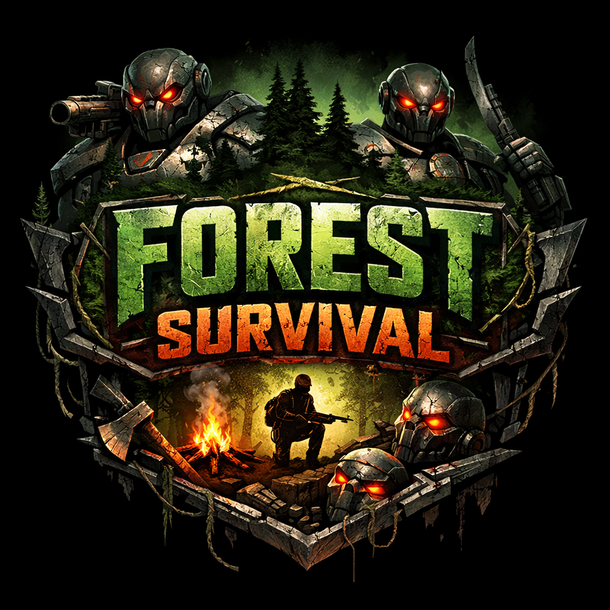

<div align="center">



# Forest Survival

A 3D first-person survival shooter built entirely through vibe coding — powered by React, TypeScript, Three.js, and AI-assisted development from the ground up.

> **Vibe Coded** — Every line of gameplay logic, AI behavior, multiplayer networking, and UI was generated through conversational AI coding. No manual game engine. Just vibes and prompts.

</div>

---

## 🎮 Gameplay

Survive endless waves of enemies in a procedurally themed forest. Fight through 4 enemy types using 7 unlockable weapons, collect power-ups, chain combo kills, and either eliminate 50 enemies to claim victory — or keep surviving as long as you can.

### Objective
Eliminate **50 enemies** to win. Each wave gets harder. Don't die.

---

## 🔫 Weapons

Weapons unlock as your score climbs:

| Weapon | Unlock Score | Ammo | Fire Rate |
|--------|-------------|------|-----------|
| Pistol | 0 | 12 | 300ms |
| Rifle | 100 | 30 | 150ms |
| Shotgun | 200 | 8 | 800ms |
| SMG | 300 | 40 | 100ms |
| Sniper | 500 | 5 | 1200ms |
| Minigun | 800 | 100 | 50ms |
| Rocket Launcher | 1200 | 3 | 2000ms |

---

## 👾 Enemies

| Type | Color | HP | Behavior |
|------|-------|----|----------|
| Normal | Red | 25 | Balanced aggression |
| Fast | Blue | 15 | Quick and agile |
| Tank | Green | 60 | Slow, heavy damage |
| Boss | Purple | 120 | Tactical, coordinates with others |

---

## ✨ Features

**Core Gameplay**
- Wave-based survival with scaling difficulty
- Combo system — chain kills within 2 seconds for bonus points
- Kill streaks with tiered notifications
- Achievement system with unlockables
- Procedural mission system with 14 mission types across 6 difficulty tiers

**AI Systems**
- Adaptive difficulty that adjusts to your skill in real time
- Enemy AI with state-machine behavior: patrol, hunt, ambush, coordinate, retreat
- Bullet dodging and obstacle avoidance on enemies
- Combat coaching with live tips
- Predictive enemy spawning
- Smart skill tree progression

**Atmosphere**
- Day/night cycle
- Dynamic weather — rain, fog, storms
- Multiple biomes
- Custom shader sky dome
- Blood splatter and impact effects

**Multiplayer**
- Peer-to-peer multiplayer via PeerJS
- In-game chat
- Spectator mode
- Multiplayer HUD and game over screens
- Lobby system

**UI & Polish**
- Glassmorphism design language
- Hit markers and damage numbers
- Kill feed
- Screen shake and damage flash effects
- Skill tree menu
- Mission display
- Stats gallery
- Tutorial overlay with progressive hints
- Full settings menu with persistence

---

## 🎁 Power-Ups

Spawn every 2 waves:

- **Health Pack** — Restore 30 HP
- **Ammo Crate** — Refill current magazine
- **Speed Boost** — Temporary movement speed increase

---

## 🎮 Controls

| Key | Action |
|-----|--------|
| W / A / S / D | Move |
| Mouse | Look around |
| Left Click | Shoot |
| Space | Jump |
| Shift | Sprint |
| R | Reload |
| 1–7 | Switch weapons |
| ESC | Pause |

---

## 📊 Scoring

| Kill | Points |
|------|--------|
| Normal Enemy | 10 |
| Fast Enemy | 15 |
| Tank Enemy | 30 |
| Boss Enemy | 100 |
| Combo Bonus | +5 × multiplier |

---

## 🚀 Getting Started

```bash
cd forest-survival

npm install        # Install dependencies
npm run dev        # Dev server at localhost:5173
npm run build      # Production build
npm run lint       # Lint check
npm run preview    # Preview production build
```

---

## 🛠️ Tech Stack

| Category | Technology |
|----------|------------|
| Framework | React 19 |
| Language | TypeScript 5 (strict) |
| 3D Engine | Three.js |
| Physics | Cannon-es |
| Build Tool | Vite 7 |
| Styling | Tailwind CSS |
| Multiplayer | PeerJS |
| AI Integration | OpenAI SDK (optional) |

---

## 📁 Project Structure

```
forest-survival/
├── src/
│   ├── App.tsx              # Core game engine — scene, loop, physics, combat
│   ├── main.tsx             # React entry point
│   ├── index.css            # Global styles
│   ├── types/
│   │   └── game.ts          # All TypeScript interfaces
│   ├── components/          # 23 React UI components
│   │   ├── HUD.tsx
│   │   ├── MainMenu.tsx
│   │   ├── GameOver.tsx
│   │   ├── PauseMenu.tsx
│   │   ├── MultiplayerLobby.tsx
│   │   ├── SkillTreeMenu.tsx
│   │   ├── MissionDisplay.tsx
│   │   └── ...
│   └── utils/               # 25 game system utilities
│       ├── AIBehaviorSystem.ts
│       ├── WeatherSystem.ts
│       ├── MultiplayerManager.ts
│       ├── SoundManager.ts
│       ├── SmartEnemyManager.ts
│       └── ...
├── public/
├── package.json
├── vite.config.ts
├── tsconfig.json
└── tailwind.config.js
```

---

## 📝 License

[MIT](https://github.com/suryanarayanrenjith/Forest-Survival/blob/master/LICENSE)
