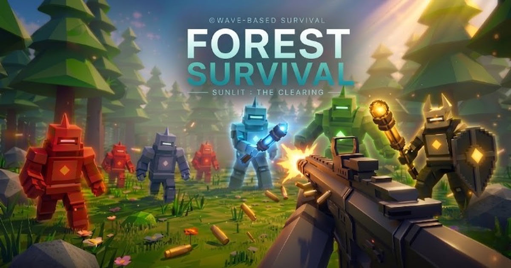

<div align="center">



**A 3D first-person wave-survival shooter built entirely through AI-assisted development.**

[](https://forestsurvival.live)
[](LICENSE)
[](https://github.com/suryanarayanrenjith/Forest-Survival/wiki)
</div>

---

Survive endless, escalating enemy waves across **eight distinct biome maps**. Fight through **5 enemy types** with **8 unlockable weapons**, choose from **8 character classes**, and push your score as high as you can. Features roguelike wave perks, daily challenges, mutators, persistent account progression, and P2P multiplayer — built with React, Three.js, Rapier physics, and Convex entirely through conversational AI coding.

---

## Official Trailer

https://github.com/user-attachments/assets/5e1322a1-d2c6-4cd4-b0f1-dd6922f0e5dd

---

## Weapons

Weapons unlock as your score climbs. Every weapon earns its own **Mastery XP** (L0 → L10).

| Weapon | Unlock Score | Ammo | Fire Rate |
|--------|-------------|------|-----------|
| Pistol | 0 | 12 | 300ms |
| Rifle | 100 | 30 | 150ms |
| Shotgun | 250 | 8 | 800ms |
| SMG | 450 | 40 | 165ms |
| Sniper | 700 | 5 | 1200ms |
| Minigun | 1,100 | 100 | 50ms |
| Rocket Launcher | 1,600 | 3 | 2000ms |
| Subverter | 2,200 | 4 chips | 850ms |

The **Subverter** is a combat hacking deck — it fires intrusion chips that turn enemies against their own kind, then burns them out in a green EMP. Bosses are immune.

---

## Characters

Eight selectable classes, each with a **signature active ability** (Q) and a mechanical passive.

| Character | Active Ability | Cooldown | Passive |
|-----------|---------------|----------|---------|
| Ranger | Dash — burst forward, bowl over enemies | 5s | −10% dash cooldown |
| Scout | Adrenaline — 1.75× movement speed (4s) | 11s | +12% movement speed |
| Heavy | Bulwark — frontal riot shield (5s) | 15s | +20% max HP, −8% speed |
| Operative | Focus Fire — faster fire rate + bigger damage (5s) | 15s | +10% headshot damage |
| Pyro | Firestorm — AoE shockwave scorches nearby enemies | 13s | Burning bullets |
| Medic | Field Triage — restore a small amount of HP | 14s | Regen 0.5 HP/sec |
| Engineer | Overclock — snap-reload + unlimited ammo (4s) | 14s | −15% reload time |
| Phantom | Cloak — vanish and phase through enemies (4s) | 15s | +15% power-up duration |

---

## Enemies

| Type | Color | Base HP | Behaviour |
|------|-------|---------|-----------|
| Normal | Crimson | 50 | Balanced aggression, closes for melee |
| Fast | Blue | 30 | Agile, dodges bullets |
| Tank | Green | 150 | Slow, heavy hitter |
| Sniper | Cyan | 40 | Kites at range, fires telegraphed energy bolts |
| Boss (Overlord) | Violet | 300 | Apex summoner — calls reinforcements, immune to Subverter |

Boss wave timing, enrage phases, mini-boss crowns, and environmental threats are detailed in the **[FAQ →](https://github.com/suryanarayanrenjith/Forest-Survival/wiki/FAQ)**

---

## Controls

| Key | Action |
|-----|--------|
| W / A / S / D | Move |
| Mouse | Look |
| Left Click | Shoot |
| Right Click | Aim (Rifle / Sniper) |
| Space | Jump |
| Shift | Sprint |
| C | Crouch |
| Q | Active Ability |
| R | Reload |
| 1–8 / Scroll | Switch weapon |
| E | Use power-up |
| F | Inspect weapon |
| M | Tactical map |
| ESC | Pause |

All action keys (except mouse, weapon slots, and Pause) are fully rebindable — see **[Configuration →](https://github.com/suryanarayanrenjith/Forest-Survival/wiki/Configuration)**

---

## Quick Start

```bash
npm install
npm run dev   # localhost:5173
```

Full setup — Convex provisioning, auth keys, environment variables, and troubleshooting — is in the **[Installation Guide →](https://github.com/suryanarayanrenjith/Forest-Survival/wiki/Installation)**

---

## Documentation

| Wiki Page | What it covers |
|-----------|---------------|
| [Technical Overview](https://github.com/suryanarayanrenjith/Forest-Survival/wiki/Technical-Overview) | Stack, runtime architecture, gameplay modules, networking, data model, deployment |
| [Installation](https://github.com/suryanarayanrenjith/Forest-Survival/wiki/Installation) | Requirements, Convex setup, local dev, production build, multiplayer notes, troubleshooting |
| [Configuration](https://github.com/suryanarayanrenjith/Forest-Survival/wiki/Configuration) | Environment variables, game settings, graphics presets, key bindings, build config |
| [FAQ](https://github.com/suryanarayanrenjith/Forest-Survival/wiki/FAQ) | Boss timing, offline play, controller support, account persistence, common questions |

---

## Acknowledgements

**[smsolutionsva-byte](https://github.com/smsolutionsva-byte)** — for generously providing the custom domain **[forestsurvival.live](https://forestsurvival.live/)** and for building the comprehensive [project Wiki](https://github.com/suryanarayanrenjith/Forest-Survival/wiki). Your support gave this project a proper home on the web and excellent documentation.

---

## License

Released under the **MIT License** — see [LICENSE](LICENSE) for the full text.
