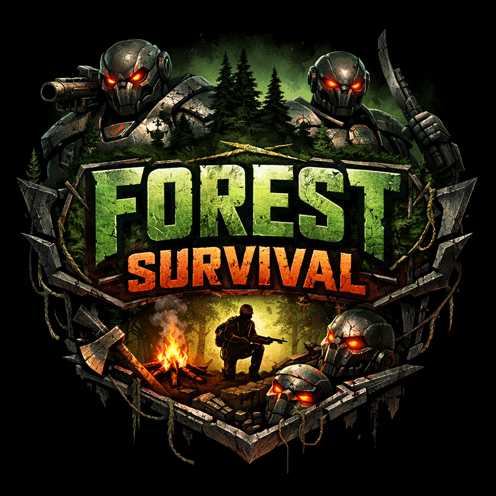

<div align="center">



# Forest Survival

A 3D first-person survival shooter built entirely through vibe coding — powered by React, TypeScript, Three.js, Rapier physics, and AI-assisted development from the ground up.

### ▶ [**Play it live → forestsurvival.live**](https://forestsurvival.live/)

[](https://forestsurvival.live/)

> **Vibe Coded** — Every line of gameplay logic, AI behavior, multiplayer networking, and UI was generated through conversational AI coding. No manual game engine. Just vibes and prompts.

</div>

---

## 🎮 Gameplay

Survive endless, escalating waves of enemies across **eight distinct biome maps**. Fight 5 enemy types with 8 unlockable weapons, gamble on a Mystery Box between waves, chase per-weapon mastery levels, hunt today's mutator + daily challenge, and push your wave count and score as high as you can.

### Objective
Endless survival — every cleared wave spawns a harder one. Climb the waves, build your score, and stay alive as long as you can.

### Maps
Eight hand-crafted, premium low-poly environments — each with its own biome, palette, atmosphere and props: **Deep Forest**, **Scorched Wasteland**, **Frozen Tundra**, **Desert Canyon**, **Toxic Swamp**, **Military Outpost**, **Twilight Vale** and **Ancient Ruins**.

---

## 🔫 Weapons

Weapons unlock as your score climbs:

| Weapon | Unlock Score | Ammo | Fire Rate |
|--------|-------------|------|-----------|
| Pistol | 0 | 12 | 300ms |
| Rifle | 100 | 30 | 150ms |
| Shotgun | 250 | 8 | 800ms |
| SMG | 450 | 40 | 165ms |
| Sniper | 700 | 5 | 1200ms |
| Minigun | 1100 | 100 | 50ms |
| Rocket Launcher | 1600 | 3 | 2000ms |
| **Subverter** | 2200 | 4 chips | 850ms |

Every weapon earns its own **mastery XP** as you kill with it (see **Weapon Mastery** below).

### 🖥️ Subverter — the robot-hacking deck

The eighth loadout slot isn't a gun at all — it's a rugged combat tablet that fires **intrusion chips** into nearby robots. A hacked enemy overclocks, turns on its own kind for a few seconds, then burns out in a green EMP blast that fries everything around it. Get in close (no scope, short range), line up a target and deploy. **Bosses are immune** — their hardened cores reject the chip entirely.

- **Live code-rain display** — the deck's screen is a real animated console (scrolling cyber glyphs over scanlines) that flares white-hot on every deploy and runs a load-scan during a reload. Machined carbon chassis, glowing accent piping and a focusing emitter prong complete the look.
- **Four physical intrusion chips** ride the deck. **Each fired chip visibly launches off the deck** — it lifts from its slot, accelerates into the emitter and vanishes down the beam — so the bay empties one chip at a time as you hack.
- **When the bay hits zero, reload slams a fresh chip cartridge in** and the four chips snap back into their slots one-by-one with a layered mechanical "data-seat" sound and a screen wash. Pickups top chips straight back in mid-fight.
- **Next-level intrusion beam** — deploying fires a jagged, flickering lightning bolt that arcs to the target with branching forks and glowing data-packets streaming down it. The hacked enemy gets a gyroscopic twin-ring containment field, a "violently installed" chip-pop, a body scanline glitch and a green→amber→red burnout tint.

---

## 🎭 Characters

Pick one of **eight distinct characters** before each run — available in Classic, Tutorial and Multiplayer modes. Every character has a **signature active ability** (triggered by the ability key, gated by a cooldown) and a mild **mechanical passive**. Each character also casts a unique full-body shadow matching their class silhouette and currently held weapon.

| Character | Active Ability | CD | Duration | Effect | Passive |
|-----------|---------------|----|----------|--------|---------|
| Ranger | **Dash** | 5s | Instant | Burst forward — bowl over enemies in your path | −10% dash cooldown |
| Scout | **Adrenaline** | 11s | 4s | 1.75× movement-speed surge | +12% movement speed |
| Heavy | **Bulwark** | 15s | 5s | Frontal riot shield soaks incoming damage | +20% max HP, −8% speed |
| Operative | **Focus Fire** | 15s | 5s | Overclock your weapon: faster fire rate + bigger damage | +10% headshot damage |
| Pyro | **Firestorm** | 13s | Instant | Detonates an AoE shockwave that scorches nearby enemies | Burning bullets (extra damage per hit) |
| Medic | **Field Triage** | 14s | Instant | Quick field patch — restores a small amount of HP (a stabiliser, not a full heal) | Regenerate 0.5 HP / sec |
| Engineer | **Overclock** | 14s | 4s | Snap-reload, then unlimited ammo | −15% reload time |
| Phantom | **Cloak** | 15s | 4s | Vanish and phase through enemies, breaking their tracking | +15% Phantom power-up duration |

---

## 👾 Enemies

Premium low-poly creatures with chest cores, shoulder plating, knee/elbow pads, glowing waist belts, back-vent panels, glowing visors and head crests. Base HP scales up with difficulty and wave number.

| Type | Color | Base HP | First seen | Behavior |
|------|-------|---------|------------|----------|
| Normal | Crimson | 50 | Wave 1 | Balanced aggression — closes for melee |
| Fast | Blue | 30 | Wave 2 | Quick, agile, dodges bullets |
| Tank | Green | 150 | Wave 3 | Slow, heavy hitter |
| **Sniper (Ranged)** | **Cyan** | **40** | **Wave 4** | **Holds a standoff ring, kites to keep its distance, charges a telegraphed energy bolt** |
| **Boss (Overlord)** | **Violet** | **300** | **Wave 10** | **Apex summoner — calls in reinforcements, immune to the Subverter** |

> Every type now approaches as a **coordinated squad** — fanning out and surrounding you from multiple sides rather than charging single-file (see **AI Systems** below).

### Mini-bosses & Boss Phases
- **Crowned Elite** — wave 5 spawns a tank wearing a yellow crown with **4× HP** and **3× score payout**, announced with a "New Threat" banner. (From wave 10 the 5-wave milestone becomes a full boss instead.)
- **The Boss era begins at wave 10.** From wave 10 onward, **Overlords** start appearing — a guaranteed one every 5th wave (10, 15, 20…) plus random spawns in between — heralded by an "Overlord — Apex · Summoner" banner.
- **Boss Summoner** — an Overlord periodically **rears up (arms thrown overhead, rising purple motes) then bursts a pack of minions into the arena**: mostly **Red (Normal)** + **Blue (Fast)** shock troops, with a **rare Sniper (Ranged)**. Each minion portals in with a coloured flash; the boss emits a purple summon shockwave. **Kill the boss to stop the adds.** Enraged (Phase 2) bosses summon bigger packs more often.
- **Subverter-proof** — bosses are **immune to the Subverter in every way**: they can't be hacked, a hacked minion will never turn on them, and the overclock EMP can't touch them.
- **Boss Enrage** — full bosses transition into **Phase 2** at 50% HP: **+35% speed, +30% damage**, paired with a damage flash, screen shake, low-pitched roar and centred "BOSS ENRAGED" banner.

### Environmental Threats
- **Explosive Barrels** — red metal barrels scattered across each map. They're **solid** — you can't walk through them, so they double as cover (and a trap). Bullet hits chip them down; a fatal hit detonates in a radius that damages enemies *and the player*, and **chain-reacts** through any other barrel in the blast. **Casting any character ability or using a power-up next to one sets it off** — e.g. a Ranger dashing over a barrel touches off a chain mid-charge.
- **Ranged Sentinels** — stationary laser turrets (3–4 per map on harder difficulties, dormant until wave 3). Telegraph each shot with a glowing red head before firing a hitscan beam. Trees block line of sight. Destroying one drops **+150 score**.

---

## ✨ Features

**Core Gameplay**
- Wave-based survival with scaling difficulty
- Combo system — chain kills within 2 seconds for bonus points
- Kill streaks with tiered notifications
- Achievement system with **19 unlockable Titles** that show up in the kill feed
- Procedural mission system with 14 mission types across 6 difficulty tiers
- **Damage direction indicator** — red threat arc sweeps around the crosshair pointing at incoming fire (CoD-style spatial awareness)

**Roguelike Wave Progression**
- 🎁 **Mystery Box** picker between waves *(Solo only)* — three face-down crates. One hides a perk; pick wisely. Number keys highlight, Enter opens.
- **15 stackable perks** in the registry (Hair Trigger, Iron Lung, Bloodletting, Drum Magazine, Detonators, Streak Keeper, Vampiric Edge, etc.) — each can appear **at most once per run** so a long run shapes a unique build.
- **Consolation reward** on a miss — wrong box still pays out `25 + wave×6` **Weapon Mastery XP**.
- Picked perks visible in the top-left HUD as coloured rarity chips throughout the run.

**Daily Mutators** *(Run Modifiers)*
Before each Classic run, choose one of three daily-rotated risk-reward modifiers — or skip for the baseline. Rotates at UTC midnight; same trio for every player that day.

| Modifier | Effect | Score |
|----------|--------|-------|
| Skull Hunter | Body shots tickle — headshots only | ×1.75 |
| Berserker | 2× damage, ½ max HP | ×1.60 |
| Glass Cannon | 3× damage, 25 HP cap | ×2.20 |
| Swarm Mode | +80% enemy spawn rate, ½ enemy HP | ×1.50 |
| One in the Chamber | Start with 1 round per weapon | ×2.00 |
| Bullet Hell | Enemies hit harder and move faster | ×1.70 |

The active mutator displays as a pulsing rose chip at the top of the HUD throughout the run.

**Daily Challenges** *(signed-in)*
A single rotating challenge per UTC day, shown on the Main Menu. Progress ticks during any Classic run. Completing it grants **+1 Skill Point** on claim.

> Examples: *Daily Cull* (100 kills), *Long Watch* (reach wave 10), *Skull Splitter* (25 headshots), *Untouchable* (3 flawless waves), *Pistols at Dawn* (30 pistol kills).

**Killstreak Airdrops**
Earn an escalating airdrop for an unbroken killstreak — a military-style crate parachutes in (sectored chute, metal banding, glowing top panel, pulsing red strobe).

| Streak | Reward |
|--------|--------|
| 5 | **Rapid Fire** — 3× fire rate for 15s |
| 10 | **Invincibility** — 5 seconds of immunity |
| 15 | **Mystery Box** — random weapon + full ammo |
| 20 | **Tactical Nuke** — vaporise every enemy on screen |

**Weapon Mastery** *(signed-in)*
Every weapon has its own **L0 → L10 mastery** ladder. Kills grant XP scaled by enemy type (bosses pay big, fast enemies pay small) and persist server-side per account. A small amber sliver under the ammo counter tracks the current weapon's XP into the next level. Per-level bonuses:

| Level | Unlock |
|------|--------|
| L3 | −5% reload time |
| L5 | −5% recoil |
| L7 | Muzzle-flash tint |
| L10 | +25% reload, +15% recoil reduction, +25% magazine size |

**AI Systems**
- Adaptive difficulty that adjusts to your skill in real time
- **Strategic squad approach** — every enemy commits to its *own* stable approach lane, so a wave fans into a two-sided pincer and **spirals in from every side at once** instead of trickling at you in a straight line. Flankers swing wide around the sides, chargers drive a tighter line, ranged snipers hang back and kite, and the ring tightens as they close for the kill. Spawns are spread evenly around the player to feed the surround. The whole behaviour tick is allocation-free so it stays cheap with a full screen of enemies.
- Per-enemy state machine: hunt · attack · investigate · patrol — **enemies never flee.** Damaging one (even a near-fatal TNT/barrel blast) no longer makes it peel away; it keeps pressing the attack to the last hit point.
- **Always squares up to you** — once an enemy closes into engagement range, gets blocked, or stops to attack, its whole body turns to face the player instead of staring off to the side along its flank-approach lane, and its head stays locked on with a wide ±70° track. (Facing you also means its frontal melee arc actually lands instead of whiffing past.)
- **Telegraphed melee** — a readable wind-up → strike → recovery arm swing with a forward lunge on the strike telegraphs every hit, so a melee strike is always signposted rather than landing from a passive bump.
- **Context-steering navigation** — repulsion + tangential avoidance and wall-sliding arc enemies around trees, with a sampling-based stuck-recovery search that reliably finds the way out of any pocket
- Bullet dodging on agile enemies
- Combat coaching with live tips
- Predictive enemy spawning
- Smart skill tree progression

**Visuals & Atmosphere**
- Premium low-poly art direction — custom-built creatures, weapons and per-biome props
- Volumetric custom sky shader with day/night cycle, drifting clouds, stars and moon
- Image-based lighting — environment reflections that make metals read as real metal
- 8 distinct biomes with unique palettes, fog and atmosphere
- **Seamless world streaming** — 5 × 5 chunk grid (~350m visible) with tightened distance fog that blends new chunks into the sky tone, so the player never sees a "world ends here" pop-in. New chunks are **budgeted in over several frames** (and prop placement uses an incremental spatial hash instead of an O(N) scan), so crossing a chunk boundary no longer hitches the frame
- **Procedural terrain** — GPU vertex-displaced rolling hills and ridges in the mid/far field; the player's combat arena stays perfectly flat so gameplay is unaffected
- **Per-biome ground materials** — macro earth-tone patches, cavity AO, micro grain, slope→rock blending, normal-mapped micro-relief, and per-map identity layers (sand ripples, snow drift + sparkle, lava cracks, wet swamp puddles)
- **Full-body player shadow** — a class-specific humanoid silhouette (holding the current weapon) is invisible to the camera but casts a believable shadow on the ground
- Full cinematic post-processing pipeline: GTAO · Unreal Bloom · ACES filmic tonemap · SMAA · HDR chromatic aberration · multi-tap volumetric god rays · anamorphic lens streaks (Ultra) · film halation · aerial perspective · CAS adaptive sharpening — all in a single custom fragment shader pass
- **Detailed first-person viewmodels with manual reloads** — every weapon is a fully animated, gloved-hands viewmodel (idle sway, walk/run bob, ADS, strafe lean, jump inertia, recoil and a CS:GO-style inspect). **Reloads are now hand-driven and paced to the real reload time**: the support hand dives to the magazine well to swap a mag and rack the action, **thumbs shells into the shotgun one-by-one** before pumping it, or seats a fresh chip cartridge into the Subverter — so the player always reloads "manually" within the reload window
- **Ragdoll death physics (Rapier-powered)** — on death, enemies are handed to a real rigid-body solver (Rapier): corpses tumble with a true inertia tensor, collide with the ground, drape and pile on one another, then settle and sleep. Capped, pooled and lazy-loaded so dozens of kills stay cheap, and it dilates correctly in bullet-time. Toggleable in Settings; multiplayer corpses and the pre-load window fall back to a lightweight launcher with the identical impulse
- Cinematic direction-aware menu transitions — pure CSS compositor animation, zero JS per-frame cost
- Blood splatter, muzzle flash and impact effects

**Multiplayer**
- Peer-to-peer multiplayer via PeerJS (no dedicated game server)
- Host-authoritative **shared enemy world** — every player fights the same enemies in the same positions; an enemy attacking one player is reflected for everyone
- **Exactly-synced waves** — the wave number is host-authoritative and advances in lockstep for everyone (guests mirror the host and never run their own wave logic, so no two players ever drift onto different waves)
- **Independent arsenals** — weapon unlocks are *not* shared: each player's guns unlock from their **own** score, so your loadout reflects your own effort even though the wave is shared
- **Snapshot interpolation** — remote players and enemies rendered via timestamped snapshot buffering (Valve-style); motion stays smooth across packet gaps without the classic lerp-to-latest stutter
- Up to 8 players, **8 selectable character classes** — each with a unique active ability and a mechanical passive (see [Characters](#-characters))
- **Host moderation** — the host can kick any player straight from the lobby; the kicked player is returned to the menu with the reason shown
- **Movement anti-cheat** — a host-side, powerup-safe sanity check ejects anyone exhibiting physically-impossible movement (teleport/speed hacks) and shows them why; deliberately movement-only so it never fights legitimate dashes, speed boosts or nukes
- *No Mystery Box in multiplayer* — the between-wave perk gamble is a **Solo-only** feature
- Floating name tags + health bars above every player
- In-game chat with quick emotes, live scoreboard HUD, spectator mode and game-over screens

> Character abilities, passives and shadow silhouettes are detailed in the [Characters](#-characters) section above — the same picks apply in Classic, Tutorial and Multiplayer.

**Accounts & Progression** (powered by Convex)
- Username / password accounts via Convex Auth — no email required
- Persistent progression stored as a single compact Convex document per player (stats, skill points, achievements bitmask, **weapon mastery XP**, **equipped title**, avatar, daily progress on its own table)
- Account rank (Bronze → Master) and level driven by kills and wins, not games played
- Smart skill tree unlocked with points earned from Solo runs and Daily Challenge claims
- Achievements are Solo-only; cross-device settings sync; privacy-aware public profiles
- **Player Profile** — a two-column hub: editable **display name**, avatar picker, stats privacy & leaderboard toggles, password change, a stats / trophies / ranks / photos showcase, and a **GitHub-style activity heatmap** of the days you've played
- **Delete account** — a password-confirmed purge that erases *every* trace of the account (profile, stats, photos, sessions, credentials and the username itself) from the database
- **Global leaderboard** — ranks all players by composite account XP (difficulty-weighted solo rank + multiplayer + meta); opt-out privacy toggle in Profile

**UI & Polish**
- Cohesive, professional dark UI built with hand-crafted Tailwind styling
- **Signature menu identity** applied uniformly across every screen (Main, Credits, Auth, Settings, Profile, Skill Tree, Photo Mode, Multiplayer and the Classic / Tutorial / Raise-the-Stakes flows): a bioluminescent-forest theme with **Oswald** condensed display + **Chakra Petch** HUD typography, dark-green glass panels framed by HUD corner-brackets, and a cinematic WebGL forest backdrop (aurora sky, lens-flare moon, survival campfire, fireflies and god-rays)
- Crisp `lucide-react` SVG iconography throughout — zero emoji chrome
- Dynamic crosshair and hit markers
- Kill feed (with cosmetic title prefixes), combo display and achievement toasts
- Screen shake and damage flash effects
- Skill tree, mission display, stats gallery
- Themed tutorial that freezes the world while you read each step
- **Full settings menu** — a complete **Graphics & Performance** suite (presets, a hand-tuned **Custom** mix, **hardware auto-detect** and an **FPS cap** — see [Graphics & Performance](#️-graphics--performance)); Audio (master / SFX / music + sound test); Gameplay toggles (ragdoll physics, **auto-reload**, **camera bob**, **show crosshair**, screen shake, hit markers, kill feed, impact feedback); Controls; UI — all persisted and synced cross-device
- **Key Bindings Editor** — 12 fully rebindable keyboard actions (Move, Jump, Sprint, Crouch, Dash, Reload, Power-Up, Tactical Map, Inspect Weapon)
- **Colorblind modes** — Protanopia, Deuteranopia and Tritanopia correction filters
- **Photo Mode** — from the Pause Menu; 8 filter presets (Original, Vivid, Noir, Sepia, Cool, Warm, Dramatic, Faded) + manual Brightness / Contrast / Saturation; captures cloud-saved to Profile → Photos
- **Shader warmup screen** — circular progress ring + staged phase checklist (Compiling shaders → Warming materials → Priming post-processing → Spawning the world) on game start

**Mobile & Tablet** (best on desktop — see [Mobile & Tablet](#-mobile--tablet))
- Auto-detected touch controls: virtual joystick, swipe-to-look, and on-screen
  buttons for every action
- Console-style aim assist for touch players
- Landscape orientation gate + best-effort fullscreen/orientation lock
- Compact, non-overlapping HUD, menus and multiplayer scoreboard/chat tuned for
  small screens and the visible (dynamic) viewport

---

## 🎁 Power-Ups

Power-ups are a **genuine reward, not a stream**: they drop only **rarely** from fallen enemies, with each wave **hard-capped at ~3–4** (just a **single drop in the opening wave**) and the few drops paced out so they never clump. The player can hold **one looted power at a time** — collect a crate, then press `E` to activate it.

- **Ammo Crate** — Refill your current magazine
- **Speed Boost** — Faster movement (10s)
- **Damage Boost** — Double weapon damage (15s)
- **Shield** — Deployable riot shield that absorbs front-arc damage (12s)
- **Infinite Ammo** — Unlimited ammo burst, no reloads
- **Overcharge** — Fire-rate + damage surge
- **Phantom** — Cloak: enemies can't see or hear you, and you pass through them

Plus **Killstreak Airdrops** delivered straight to you (see Killstreak Airdrops above): Rapid Fire, Invincibility, Mystery Box weapon swap, Tactical Nuke.

> By design there is **no healing** power-up — your only damage mitigation is the shield, the Medic class passive in multiplayer, the Adrenaline / Bloodletting / Vampiric Edge wave perks, and not getting hit.

---

## 🎮 Controls

### Desktop (keyboard & mouse)

| Key | Action |
|-----|--------|
| W / A / S / D | Move |
| Mouse | Look around |
| Left Click | Shoot |
| Right Click | Aim (Rifle / Sniper) |
| Space | Jump |
| Shift | Sprint |
| C | Crouch |
| Q | Dash / Active Ability |
| R | Reload |
| 1–8 / Scroll | Switch weapons |
| E | Use held power-up |
| F | Inspect weapon (CS:GO-style — turns the gun in to show it off) |
| M | Toggle expanded tactical map |
| ESC | Pause |

> All movement and action keys (except mouse, weapon slots and Pause) are **fully rebindable** in Settings → Controls.

### Mystery Box picker *(Solo)*

| Key | Action |
|-----|--------|
| 1 / 2 / 3 | Highlight a box |
| ← / → or A / D | Browse |
| Enter / Space | Open the highlighted box |

The picker releases the pointer lock and blocks gameplay input so a stray click can't fire through the overlay.

---

## 📱 Mobile & Tablet

> ⚠️ **Best experienced on desktop or laptop.** Forest Survival is built and tuned
> for keyboard & mouse. It is **fully playable** on phones and tablets via on-screen
> touch controls, but the mobile experience may not be as polished — for the best
> experience, play on a desktop or laptop.

Touch devices are auto-detected and the game remaps to on-screen controls:

| Touch control | Action |
|---------------|--------|
| Left joystick | Move (push to the edge to sprint) |
| Swipe right side | Look around (with console-style **aim assist**) |
| FIRE button | Shoot |
| Aim button | Aim down sights (Rifle / Sniper) |
| Jump / Dash / Crouch buttons | Movement actions |
| Power button | Use held power-up |
| Reload button | Reload |
| Weapon button | Switch weapons |
| Pause button | Pause menu |

- **Landscape only** — a rotate prompt appears in portrait; the game requests
  fullscreen + landscape lock on start where supported.
- The HUD, menus and multiplayer scoreboard/chat all adapt to a compact,
  non-overlapping touch layout sized to the visible viewport.
- **Haptic feedback** — context-sensitive vibration patterns for fire, hit, headshot, reload, dash, damage received, kill and explosion; rate-limited on full-auto so it never becomes a continuous buzz; toggleable in Settings.

---

## ⚙️ Graphics & Performance

A full AAA-style graphics suite lives under **Settings → Display**. Everything is persisted locally and **synced to your account** as a single compact, sparse blob (only values that differ from the defaults are stored), so your setup follows you across devices.

### Presets

Five one-click quality tiers, each a balanced bundle of resolution, shadows, post-FX, particles, draw distance, terrain detail and the enemy cap:

| Preset | Target | Highlights |
|--------|--------|------------|
| **Ultra Low** | Max FPS · weakest hardware | 50% render scale, no shadows/post-FX, minimal particles, tightest draw distance, lowest terrain tessellation |
| **Low** | Best performance | 65% render scale, no shadows/post-FX, sparse particles |
| **Medium** | Balanced | Soft 1024² shadows, bloom + cinematic grade, ~85% render scale |
| **High** | Best visuals *(default)* | Native res, MSAA, crisp 2048² shadows, full post-FX stack |
| **Ultra** | Cinematic | Super-sampled, 4096² shadows, god rays + SMAA, every effect maxed |

### Custom mix

Tweak any individual control and the preset row flips to a clearly-indicated **Custom** state (an amber "● Custom enabled" badge + a dedicated Custom tile, just like a AAA PC port). Advanced controls:

- **Resolution Scale** (40–120%) — internal render resolution; the single biggest performance lever
- **Shadows** — Off / Low / Med / High / Ultra (drives shadow-map size + penumbra softness)
- **Particle Density** (0–100%)
- **Render Distance** (72–300 m)
- **Terrain Detail** (25–100%) — grass + scattered-prop density and ground tessellation
- **Max Enemies** (6–40) — your own hard ceiling on simultaneous foes
- **Post-Processing** and **Anti-Aliasing** toggles

The engine resolves the active preset (or your custom mix) once at match start.

### Hardware Auto-Detect

One tap on **Auto-Detect Best Preset** probes your browser/device — **CPU threads** (`navigator.hardwareConcurrency`), **device memory**, and the **GPU** (via a throwaway WebGL context's unmasked renderer string + capabilities), plus a mobile check — scores it conservatively, and applies the matching preset. It also runs automatically on a fresh install (no saved preference) so the game opens at a sensible tier for your machine. A short readout shows what it found, e.g. `12-thread CPU · 8GB RAM · NVIDIA GeForce RTX 4070 → Ultra`. *(The browser exposes logical processors/threads, not physical cores.)*

### FPS Cap

Choose **30 / 60 / 120 / Unlimited**. Unlimited follows your display's refresh rate (V-Sync); the capped modes throttle the render loop to the target while keeping gameplay correctly time-stepped. A frame rate can never exceed the monitor's refresh, so e.g. 120 on a 60 Hz panel reads ~60.

---

## 📊 Scoring

| Kill | Points |
|------|--------|
| Normal Enemy | 10 |
| Fast Enemy | 15 |
| Tank Enemy | 30 |
| Sniper (Ranged) | 28 |
| Boss Enemy | 100 |
| Crowned Elite (Mini-Boss) | × 3 of the underlying type |
| Sentinel Destroyed | 150 |
| Combo Bonus | +5 × multiplier |

Score is then multiplied by the active **difficulty bonus** (Easy 0.6 / Medium 1.0 / Hard 1.7 / Adaptive 1.3) and the **Run Modifier** multiplier if one is active.

### Difficulty tuning
Medium and Hard were re-balanced to fit the new threat density (Snipers, Sentinels, Explosive Barrels):

| Mode | HP × | Damage × | Spawn × | Speed × |
|------|------|----------|---------|---------|
| Easy | 0.90 | 0.80 | 0.70 | 0.60 |
| Medium | **1.40** | **1.25** | **1.00** | **1.05** |
| Hard | **2.20** | **1.85** | **1.40** | **1.50** |
| Adaptive | 1.30 | 1.20 | 1.00 | 0.95 |

---

## 🚀 Getting Started

```bash
cd forest-survival

npm install        # Install dependencies
npm run dev        # Dev server at localhost:5173
npm run build      # Production build
npm run lint       # Lint check
npm run preview    # Preview production build
```

Accounts, multiplayer ranks and progression are backed by **Convex**. For these to work locally, provision a dev backend once and leave it running in a second terminal — it writes `VITE_CONVEX_URL` into `.env.local` for you (see `.env.example`):

```bash
npx convex dev          # provisions the dev DB, pushes functions, syncs .env.local
npx @convex-dev/auth     # one-time: generate the auth keys on the dev deployment
```

---

## 🛠️ Tech Stack

| Category | Technology |
|----------|------------|
| Framework | React 19 |
| Language | TypeScript 5 (strict) |
| 3D Engine | Three.js + @react-three/fiber + @react-three/drei |
| Physics | Rapier (`@dimforge/rapier3d-compat`) for engine-grade death ragdolls — lazy-loaded WASM; lightweight custom kinematics everywhere else |
| Post-processing | three.js native (EffectComposer + GTAO + UnrealBloom + SMAA + custom ACES grade) |
| Build Tool | Vite 7 |
| Styling | Tailwind CSS |
| Icons | lucide-react |
| Multiplayer | PeerJS (peer-to-peer) |
| Backend & Database | Convex (reactive DB + serverless functions) |
| Authentication | Convex Auth (username / password) |
| Hosting | Vercel |

---

## 📁 Project Structure

```
forest-survival/
├── src/
│   ├── App.tsx              # Core game engine — scene, loop, physics, combat
│   ├── main.tsx             # React entry point
│   ├── index.css            # Global styles
│   ├── types/
│   │   └── game.ts          # All TypeScript interfaces
│   ├── components/          # React UI components
│   │   ├── HUD.tsx
│   │   ├── MainMenu.tsx
│   │   ├── GameOver.tsx
│   │   ├── PauseMenu.tsx
│   │   ├── MultiplayerLobby.tsx
│   │   ├── CharacterSelect.tsx      # Solo / Tutorial character picker
│   │   ├── SkillTreeMenu.tsx
│   │   ├── MissionDisplay.tsx
│   │   ├── WavePerkPicker.tsx       # Mystery Box overlay
│   │   ├── RunModifierPicker.tsx    # Daily mutator picker
│   │   ├── DailyChallengeCard.tsx   # Main-menu daily card
│   │   ├── LeaderboardMenu.tsx      # Global leaderboard
│   │   ├── PhotoMode.tsx            # In-game photo mode (from Pause Menu)
│   │   ├── KeyBindingsEditor.tsx    # Rebindable key controls
│   │   ├── DamageDirectionIndicator.tsx  # Threat arc overlay
│   │   ├── ShaderProcessingScreen.tsx   # Shader warmup loading screen
│   │   ├── MenuTransition.tsx       # Direction-aware cross-screen transitions
│   │   └── ...
│   └── utils/               # Game system utilities
│       ├── AIBehaviorSystem.ts
│       ├── WeatherSystem.ts
│       ├── MultiplayerManager.ts
│       ├── SoundManager.ts
│       ├── SmartEnemyManager.ts
│       ├── RagdollSystem.ts             # Rapier rigid-body death ragdolls (lazy WASM)
│       ├── WavePerkRegistry.ts          # 15 perks + mystery roll
│       ├── RunModifierSystem.ts         # 6 mutators + daily roll
│       ├── DailyChallengeRegistry.ts    # 5 challenges + UTC roll
│       ├── WeaponMasterySystem.ts       # Per-weapon XP & levels
│       ├── CharacterPassiveRegistry.ts
│       ├── CharacterAbilityRegistry.ts  # 8 active abilities (all modes)
│       ├── CharacterModels.ts           # Low-poly humanoid class builders
│       ├── LocalPlayerShadow.ts         # Full-body shadow caster
│       ├── TerrainSystem.ts             # GPU vertex-displaced procedural terrain
│       ├── SnapshotInterpolator.ts      # Valve-style netcode interpolation
│       ├── haptics.ts                   # Mobile vibration feedback
│       ├── CosmeticTitles.ts            # Achievement → title map
│       ├── HazardSystem.ts              # Explosive barrels
│       ├── RangedSentinelSystem.ts      # Laser turrets
│       └── ...
├── convex/                  # Convex backend
│   ├── schema.ts
│   ├── playerStats.ts       # + addWeaponMasteryXp, equipTitle
│   ├── daily.ts             # Daily challenge progress / claim
│   └── ...
├── public/
├── package.json
├── vite.config.ts
├── tsconfig.json
└── tailwind.config.js
```

---

## 🙏 Acknowledgements

- **smsolutionsva-byte** ([github.com/smsolutionsva-byte](https://github.com/smsolutionsva-byte)) — for generously providing the game's custom domain, **[forestsurvival.live](https://forestsurvival.live/)**. Huge thanks for giving Forest Survival a proper home on the web. 💚

---

## 📝 License

[MIT](https://github.com/suryanarayanrenjith/Forest-Survival/blob/master/LICENSE)
